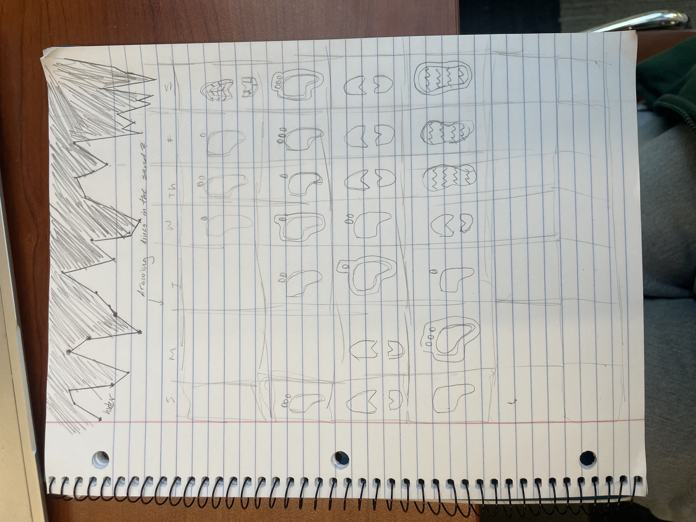
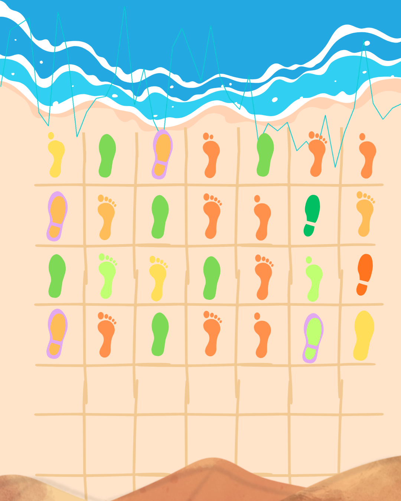
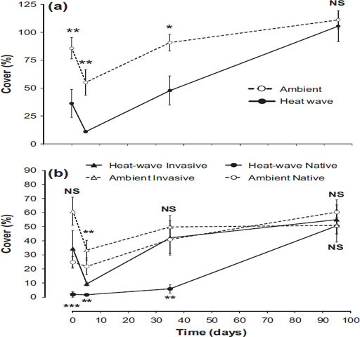

[Github repository](https://github.com/hendersonvo/ENVS-193DS_homework-03#)

# Part 1. Set up tasks

```{r}
# load libraries
library(tidyverse)
library(here)
library(janitor)
library(readxl)

# read data
salinity <- read_csv(here("data", "salinity-pickleweed.csv"))
salinity_clean <- salinity |> 
  clean_names() |> 
  rename(salinity_ms_cm = salinity_m_s_cm)
personal <- read_csv(here("data", "envs193ds-personal-data.csv")) |> 
  clean_names() |> 
  mutate(date = as.Date(date, format = "%m/%d/%Y"))
```

# Part 2. Problems

## Problem 1. Slough soil salinity

### a. An appropriate test

There are two appropriate ways to test the strength of the relationship between salinity and California pickleweed biomass: Pearson's correlation test and a Spearman rank correlation test. The Pearson's correlation test is a parametric test (uses precise data values, not ranks), and it might be appropriate because our variables are continuous and we can check for normality. On the other hand, the Spearman rank correlation is a nonparametric test (uses ranks, not precise data values), and it might be appropriate because we can check for a monotonic relationship between our variables.

### b. Create a visualization

```{r}
ggplot(data = salinity_clean, # use cleaned salinity data
       aes(x = salinity_ms_cm, # set salinity to x-axis 
           y = pickleweed)) +  # set biomass to y-axis
  geom_point(color = "turquoise3",# change point colors
             size = 2.5) + # make points bigger
  labs(x = "Salinity (in mS/cm)", # add labels to axes and add title
       y = "California pickleweed biomass (in g)",
       title = "Scatterplot of pickleweed biomass vs. salinity") +
  theme_minimal() # change theme
```

### c. Check your assumptions and run your test

#### Checking assumptions

We want to run a Pearson's correlation test, so we will check for (1) continuity and (2) normality within our two variables, (3) independence of observations, and (4) a linear relationship between our two variables. 

We already know that salinity and biomass are both continuous variables because they can take on any values in a given range. Our first assumption is correct! Additionally, if we know that our observations were taken randomly, then we can assume that the measurements of one pickleweed individual should not be influenced by the measurements of another pickleweed individual. Then each observation is independent and the third assumption is correct!

Now we will check for normality.

**Visual checks: normality**

```{r}
#| label: qq plot for salinity
ggplot(data = salinity_clean, # used cleaned salinity data
       aes(sample = salinity_ms_cm)) + # set salinity measurements against theoretical values
  geom_qq_line(color = "red") + # add a reference line, make it red
  geom_qq() + # add the rest of the qq plot
  labs(title = "QQ plot of salinity variable data") + # add a title 
  theme_minimal() # change the theme
```

The red line in this plot represents a theoretical normal distribution, so if our points fall directly on the red line, we would conclude that our data is perfectly normal. We can see that our salinity data appears to be relatively normal based on how our points (observations) roughly follow the red line. Let's check our pickleweed biomass next.

```{r}
#| label: qq plot for biomass
ggplot(data = salinity_clean, # use cleaned salinity data
       aes(sample = pickleweed)) + # set biomass data against theoretical values
  geom_qq_line(color = "red") + # add a reference line, make it red
  geom_qq() + # add the rest of the qq plot
  labs(title = "QQ plot of pickleweed biomass variable data") + # add a title
  theme_minimal() # change the theme
```

Our pickleweed biomass observations appear to also be relatively normal because, aside from the tail ends, these points similarly appear to roughly follow the line. We can look past the minor deviations since Pearson's correlation test is robust to slight violations in normality at the tails.

**Visual check: linearity**

We'll revisit the scatterplot we created above.

```{r}
ggplot(data = salinity_clean, # use cleaned salinity data
       aes(x = salinity_ms_cm, # set salinity to x-axis 
           y = pickleweed)) +  # set biomass to y-axis
  geom_point(color = "turquoise3",# change point colors
             size = 2.5) + # make points bigger
  labs(x = "Salinity (in mS/cm)", # add labels to axes and add title
       y = "California pickleweed biomass (in g)",
       title = "Scatterplot of pickleweed biomass vs. salinity") +
  theme_minimal() # change theme
```

We can see that as we follow the plot along the x-axis to the right, the points also visually seem to shift further upwards along the y-axis. These shifts seem to be consistent as we move along the x-axis (the points don't begin to follow a curved path or switch directions), so we can confirm linearity between our soil salinity and pickleweed biomass variables.

**Conclusion**

Since our two variables both appear to be relatively normal, they are both continuous, the observations are independent, and the relationship between the two variables is linear, we can continue with the test!

#### Running the test

```{r}
cor.test(x = salinity_clean$salinity_ms_cm, # first variable
         y = salinity_clean$pickleweed, # second variable
         method = "pearson") # select type of correlation test, Pearson in this case
```

### d. Results communication

To evaluate the strength of the relationship between pickleweed biomass and soil salinity, we used a Pearson's correlation test which is designed to test the correlation between two continuous, normally distributed variables. We can see that we have found a moderate positive relationship between soil salinity and pickleweed biomass (Pearson's r = 0.53, t(21) = 2.90, p = 0.009, $\alpha$ = 0.05).

### e. Test implications

We have found that the relationship between pickleweed biomass and soil salinity is positive and moderately strong. This means that, on average, where we observe higher salinity soils, we might also expect to see higher pickleweed biomass. This implies that if restoration teams treat higher pickleweed biomass as a measure of restoration success, then they should consider having higher salinity soil at their restoration sites.

### f. Double check your own work

```{r}
cor.test(x = salinity_clean$salinity_ms_cm, # first variable
         y = salinity_clean$pickleweed, # second variable
         method = "spearman") # select type of correlation test, Spearman in this case
```

Based on the results of these two tests, I would have made the same decision to reject the null hypothesis: that the true correlation between the two variables is equal to 0; and I would have also made the same biological interpretation: these results also reflect a moderate positive relationship between soil salinity and pickleweed biomass (Spearman $\rho$ = 0.59, S = 824, p = 0.003, $\alpha$ = 0.05). We can see that the Pearson test gave us a significant (p = 0.008) correlation value (`cor`) of 0.53 and the Spearman test gave us a significant (p = 0.003) correlation value (`rho`) of 0.59. Since we consider correlation coefficients ranging from |0.4| - |0.6| to be a moderate strength correlation, we would conclude in both tests that the correlation between soil salinity and pickleweed biomass is moderately strong.

## Problem 2. Personal data

### a. Updating your visualizations

**Updated plot 1: steps vs. weekday**

```{r}
ggplot(data = personal, # use personal data
       aes(x = weekday, # set x-axis to predictor variable (weekday)
           y = steps_taken, # set y-axis to response variable (steps)
           color = weekday)) + # differentiate by weekday
  geom_boxplot(width = 0.4) + # add a boxplot, adjust width
  geom_jitter(width = 0.1, # add jitter points, adjust width
              height = 0, # no height jitter
              alpha = 0.6) + # adjust transparency
  scale_color_manual(values = c("Yes" = "blue",
                                "No" = "orange")) +
  labs(x = "Weekday (Yes/No)", # add labels to axes, and add a title and subtitle
       y = "Number of steps taken",
       title = "Boxplots showing the distribution of steps taken on \nweekdays vs. weekends",
       subtitle = "Most recent observation: 3/4/2026") +
  theme_classic() + # change the theme
  theme(legend.position = "none") # remove the legend
```

**New plot 2: steps vs. weather**

```{r}
ggplot(data = personal, # use personal data
       aes(x = weather, # set x-axis to predictor variable (weather)
           y = steps_taken,
           color = weather)) + # differentiate by weekday
  geom_boxplot(width = 0.4) + # add a boxplot, adjust width
  geom_jitter(width = 0.1, # add jitter points, adjust width
              height = 0, # no height jitter
              alpha = 0.6) + # adjust transparency 
  scale_color_manual(values = c("Overcast" = "darkgrey",
                                "Sunny" = "gold2",
                                "Rainy" = "turquoise3")) +
  labs(x = "Weather", # add labels to axes, and add a title and subtitle
       y = "Number of steps taken",
       title = "Boxplots showing the distribution of steps taken by weather type",
       subtitle = "Most recent observation: 3/4/2026") +
  theme_classic() + # change the theme
  theme(legend.position = "none") # remove the legend
```

### b. Captions
**Figure 1. Number of steps does not differ between weekdays and weekends.** Boxes represent the Interquartile Range (IQR), the central line represents the median measurement, and the tails represent 1.5 $\times$ IQR. Individual points represent individual measurements in each day type (weekends: yellow, weekdays: blue). Weekdays appear to have a higher variance than weekends. Data source: collected by myself.

**Figure 2. Number of steps does differ between different weather conditions.** Boxes represent the Interquartile Range (IQR), the central horizontal line represents the median measurement, and the tails represent 1.5 $\times$ IQR. Individual points represent individual measurements for each weather type (overcast: grey, rainy: blue, sunny: gold). Sunny days appear to have a higher variance than other conditions. Data source: collected by myself. 


## Problem 3. Affective visualization

### a. Describe in words what an affective visualization could look like for your personal data (3-5 sentences).

Since the data I collected was about the number of steps I took everyday, I could create a setting like a beach shore and use footprints to represent individual observations. I can also use the time series of step counts to shape the waves coming in from the ocean. I can use colors to indicate the magnitude of steps I took, and use different kinds of trimmings to indicate my categorical variables like my on-call status on a particular day. I could also make it look like I am drawing a calendar in the sand to articulate a structured arrangement of footprints. The number of toes can represent every 50mg of caffeine consumed on the day. 

### b. Create a sketch (on paper) of your idea.



### c. Make a draft of your visualization.



### d. Write an artist statement
In this piece, I am showing the number of steps I take every day. The grid is meant to represent a calendar, with each grid representing one day in a Sunday-Saturday sequence. Each footprint represents data about the number of steps (color), whether I had caffeinated drinks that day (barefoot for caffeine vs. shoe for no caffeine), and whether I was on-call for my building (purple outline). I was inspired by Stefanie Posavec and Giorgia Lupi's Dear Data project where they use colors and symbolism to consolidate a day's worth of stories into little segments. I was also inspired by Jill Pelto's paintings which integrate graphs into depictions of natural landscapes, so I also included a time series of my step counts as part of the water. The form of my work is a digital portrait that I made in Canva. I created my work by using a beach template and organizing Canva elements to create the setting I wanted. I created the time series myself in Excel and overlayed the image over the rest of my work.


### e. Prep your materials to share it in class.

[View.](https://docs.google.com/presentation/d/1vGScMg_0jbmKZA3vX-yRTrWSo4_ykWvme4L-Mit0twE/edit?usp=sharing)

## Problem 4. Statistical critique

### a. Revisit and summarize

For this figure, the x-axis describes the time of the treatment application in days and the y-axis describes the percent cover. This figure is meant to demonstrate how different fouling species population changed over time following a treatment of increased temperature. We can see from the figure that, on average, populations are larger in ambient treatments compared to heat-wave treatments, and invasives tend to recover more quickly than natives.



### b. Visual clarity

The authors of the paper visually represented their statistics in a logical way, since their x- and y-axes clearly and intuitively represent change in response variable (% cover on y-axis) over time (days on x-axis). The predictor variables (ambient/heatwave, native/invasive) are also differentiated with different lines on the same plot with a legend to aid the reader. They also show summary statistics, with each data point being the mean and bars representing $\pm$ 1 SE, however the underlying data is not included. 

### c. Aesthetic clarity

I think the authors have a pretty low data:ink ratio, or a higher level of visual clutter compared to the information being shown. For instance, the authors fit two plots into one figure, which stretches and distorts each plot and automatically increases the amount of interpretation required of the reader. Secondly, there are many symbols on the screen indicating treatment, species type, and significance--many of which overlap--and two legends instead of one for the figure. However, the authors do succeed in removing grid lines and unnecessary borders. 

### d. Recommendations

I would split up the figure into two separate figures as figure 3a and figure 3b. This immediately reduces the amount of visual clutter on one figure and gives each plot the necessary white space to accommodate the various symbols and legends. With the additional space, the other points I made about overlapping elements and additional legends would feel less impactful.